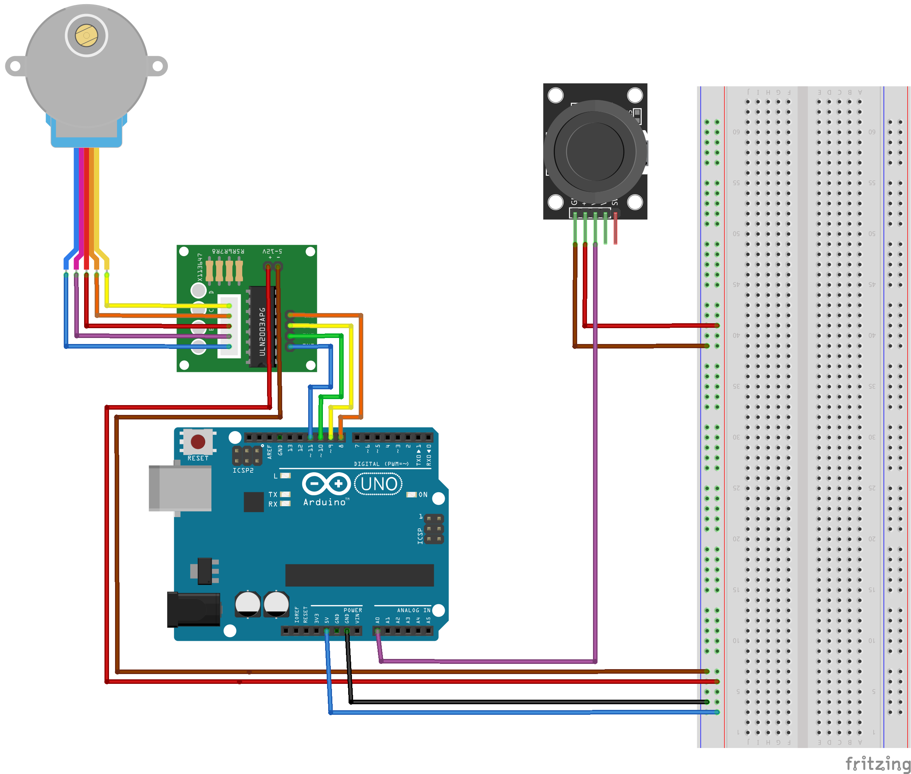

= Arduino Example 1

== Stepped motor controlled with joystick

NOTE: This is test-only solution. Because of using "delay" is incorrect.

Created with https://www.jetbrains.com/clion/[CLion] and https://plugins.jetbrains.com/plugin/13922-platformio-for-clion[PlatformIO] plugin

.Layout

.Used parts:
* Arduino UNO
* Joystick AY-023/HW-504
* Step Motor 28BYJ-48
* Motor drivers 2PH78500A
* Breadboard
